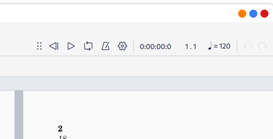
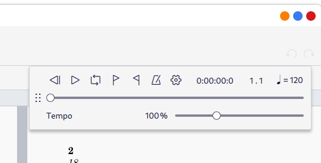
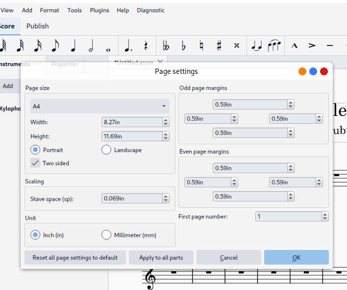

# Music
These files are mainly designed for use with musescore, but MusicXML files are also provided.

MuseScore is free open source software.

## Links

[MuseScore home page (Windows/Mac/Linux)](https://musescore.org/en)

[Simple Musecore Tutorial](./videos/tutorial.mp4)

[Zip file containing all MuseScore files](./alltunes.zip)

## Musescore installation

#### Youtube Videos

[Installing applications on Macintosh (Appstore and Downloaded)](https://www.youtube.com/watch?v=jg2qhKkdrnA)

I don't think Musescore is in the application store, the relevant bit starts at about 1 min 45 seconds. This one is presented by Harry Potter.

[Installing MuseScore on Windows/MacOS](https://www.youtube.com/watch?v=zU3YlZ4pjEc)

The process is for Windows but MacOS is much the same, apparently.

Another alternative is to download the non musehub version "Musescore Studio without Musehub"

## Notes and Hints

#### Using it as Musico-style playback

When doing the tutorial I forgot to mention that you can make it play straight left to right by clicking on the "Page View" button at the bottom right.

#### Changing the tempo

It's not immediately obvious (putting it mildly), but you can access the tempo slider by undocking the playback control which is by default attached to the toolbar. 

If you point the mouse at the six dots,  press and hold the mouse button and drag it it should pop out of the toolbar and expand like the picture below.

You can also change the speed permanently by editing the speed setting in the score.

#### Fitting music on a page for printing

I found when printing that occasionally you'd get two pages, with a little bit left over spilling onto a third, rather like with a word processor where it doesn't quite fit.

You can change this using the menu option *Format / Page Settings*, which brings up the following settings, and by adjusting '**Stave Space**' you can make the music on the page larger or smaller.

It is also possible to reclaim some space by removing system breaks, which you do with the menu option *Format / Add/Remove Sytstem Breaks* and choosing the option of "Remove all System Breaks" if it doesn't quite fit. 

